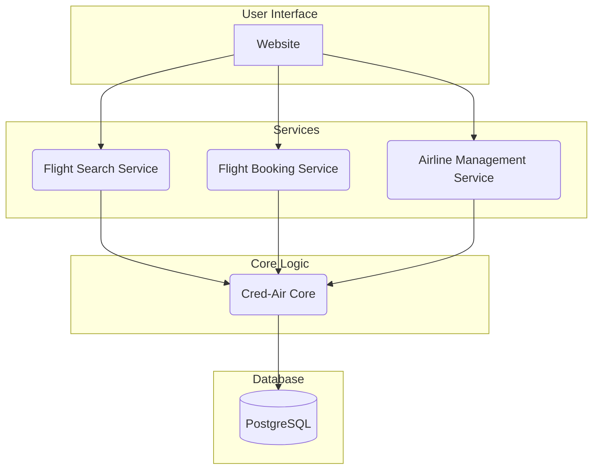
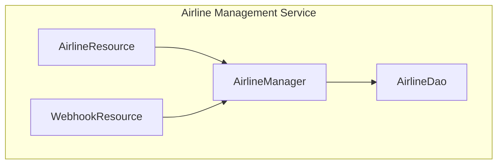
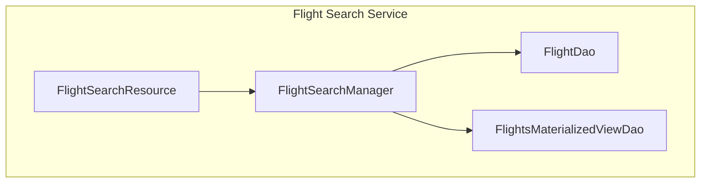
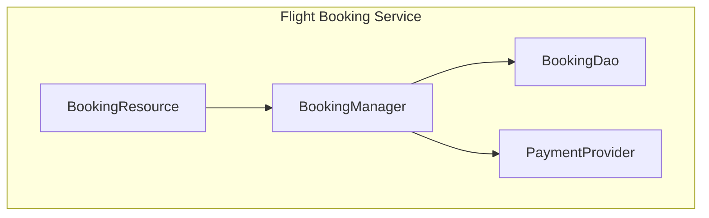

# Cred-Air - Airline Aggregation System

This project is an airline aggregation system that allows users to search for and book flights from multiple airlines.

## System Architecture

The system is designed with a microservices architecture, separating concerns into distinct services for better scalability and maintainability.



## Modules

The project is divided into the following modules:

- **`website`**: A React-based frontend for user interaction.
- **`cred-air-core`**: The core module containing shared business logic, data models, and database interactions.
- **`airline-mgt-service`**: Manages airline data and onboarding.
- **`flight-search-service`**: Provides flight search functionality.
- **`flight-booking-service`**: Handles the flight booking process.

### Service Components

Here's a more detailed look at the components within each service:

#### Airline Management Service



#### Flight Search Service



#### Flight Booking Service



## Running the Services

To run all the services, use the `run.sh` script:

```bash
./run.sh
```

Alternatively, you can run each service individually. To run any of the services, navigate to the service's root directory and execute the following Maven command:

```bash
mvn clean install exec:java -Dexec.args="server src/main/resources/server-config.yml"
```

Or, run each service from the project root:

- **Airline Management Service:**
  ```bash
  mvn -pl airline-mgt-service clean install exec:java -Dexec.args="server airline-mgt-service/src/main/resources/server-config.yml"
  ```

- **Flight Search Service:**
  ```bash
  mvn -pl flight-search-service clean install exec:java -Dexec.args="server flight-search-service/src/main/resources/server-config.yml"
  ```

- **Flight Booking Service:**
  ```bash
  mvn -pl flight-booking-service clean install exec:java -Dexec.args="server flight-booking-service/src/main/resources/server-config.yml"
  ```

## Technology Stack

- **Language**: Kotlin
- **Framework**: Dropwizard
- **Frontend**: React
- **Build Tool**: Maven
- **Database**: PostgreSQL

## Design Principles

- **Modularity**: The system is divided into independent modules, each with a specific responsibility. This promotes separation of concerns and makes the system easier to maintain and scale.
- **Interfaces**: We will make extensive use of interfaces to promote loose coupling and plug-and-play architecture. This will allow us to easily swap out implementations without affecting other parts of the system.
