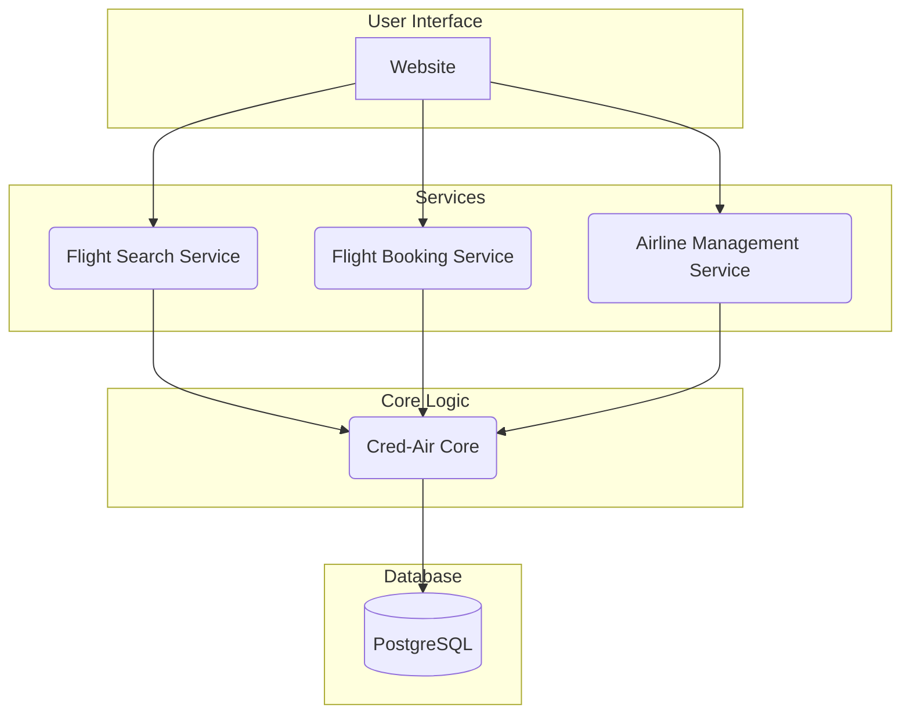
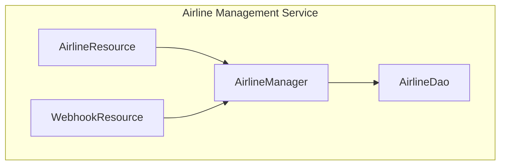
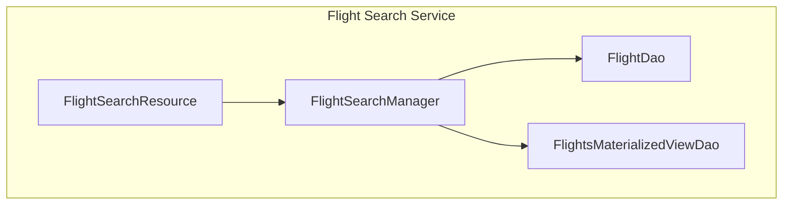
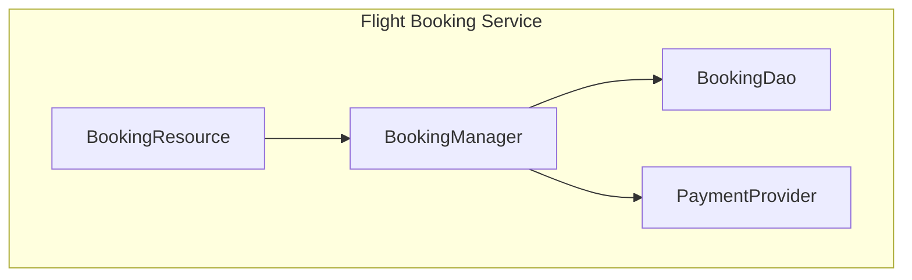

# Cred-Air - Airline Aggregation System

This project is an airline aggregation system that allows users to search for and book flights from multiple airlines.

## System Architecture

The system is designed with a microservices architecture, separating concerns into distinct services for better scalability and maintainability.



## Modules

The project is divided into the following modules:

- **`website`**: A React-based frontend for user interaction.
- **`cred-air-core`**: The core module containing shared business logic, data models, and database interactions.
- **`airline-mgt-service`**: Manages airline data and onboarding.
- **`flight-search-service`**: Provides flight search functionality.
- **`flight-booking-service`**: Handles the flight booking process.

### Service Components

Here's a more detailed look at the components within each service:

#### Airline Management Service



#### Flight Search Service



#### Flight Booking Service



## Running the Services

To run all the services, use the `run.sh` script:

```bash
./run.sh
```

Alternatively, you can run each service individually. To run any of the services, navigate to the service's root directory and execute the following Maven command:

```bash
mvn clean install exec:java -Dexec.args="server src/main/resources/server-config.yml"
```

Or, run each service from the project root:

- **Airline Management Service:**
  ```bash
  mvn -pl airline-mgt-service clean install exec:java -Dexec.args="server airline-mgt-service/src/main/resources/server-config.yml"
  ```

- **Flight Search Service:**
  ```bash
  mvn -pl flight-search-service clean install exec:java -Dexec.args="server flight-search-service/src/main/resources/server-config.yml"
  ```

- **Flight Booking Service:**
  ```bash
  mvn -pl flight-booking-service clean install exec:java -Dexec.args="server flight-booking-service/src/main/resources/server-config.yml"
  ```

## Technology Stack

- **Language**: Kotlin
- **Framework**: Dropwizard
- **Frontend**: React
- **Build Tool**: Maven
- **Database**: PostgreSQL

## Design Principles

- **Modularity**: The system is divided into independent modules, each with a specific responsibility. This promotes separation of concerns and makes the system easier to maintain and scale.
- **Interfaces**: We will make extensive use of interfaces to promote loose coupling and plug-and-play architecture. This will allow us to easily swap out implementations without affecting other parts of the system.

## Development Setup

### Prerequisites
- JDK 21 or higher
- Maven 3.6+
- PostgreSQL 12+
- Node.js 16+ (for website)
- Yarn (for website dependency management)

### Database Setup
1. Install PostgreSQL
2. Create a database named `credair`
3. Run migration scripts from `cred-air-core/src/main/resources/db/migration/`

### Environment Configuration
Each service requires configuration files in `src/main/resources/server-config.yml`. Update database connection details and other environment-specific settings.

## API Documentation

### Service Endpoints

#### Flight Search Service (Port 8081)
- `GET /search` - Search for flights
- `GET /health` - Health check

#### Flight Booking Service (Port 8082)
- `POST /booking` - Create a new booking
- `GET /booking/{id}` - Get booking details
- `POST /webhook` - Handle payment webhooks
- `GET /health` - Health check

#### Airline Management Service (Port 8083)
- `GET /airlines` - List all airlines
- `POST /airlines` - Create new airline
- `POST /webhook` - Handle airline webhooks
- `GET /health` - Health check

## Testing

Run tests for all modules:
```bash
mvn clean test
```

Run tests for a specific module:
```bash
mvn -pl <module-name> test
```

## Development Workflow

1. Build and test all services:
   ```bash
   mvn clean install
   ```

2. Run all services:
   ```bash
   ./run.sh
   ```

3. Access the website at `http://localhost:3000`

## Project Structure

```
cred-air/
├── airline-mgt-service/      # Airline management microservice
├── flight-search-service/    # Flight search microservice
├── flight-booking-service/   # Flight booking microservice
├── cred-air-core/           # Shared core library
├── website/                 # React frontend application
├── run.sh                   # Script to run all services
├── pom.xml                  # Root Maven configuration
├── README.md               # This file
└── architecture.md         # Detailed system architecture
```

## Contributing

1. Follow the existing code style and patterns
2. Write tests for new functionality
3. Update documentation as needed
4. Ensure all tests pass before submitting changes

## Troubleshooting

### Common Issues

1. **Port conflicts**: Ensure ports 8081, 8082, 8083 are available
2. **Database connection**: Verify PostgreSQL is running and credentials are correct
3. **Build failures**: Run `mvn clean install` to resolve dependency issues

### Logs
Service logs are available in the console output when running services individually or via `run.sh`.
