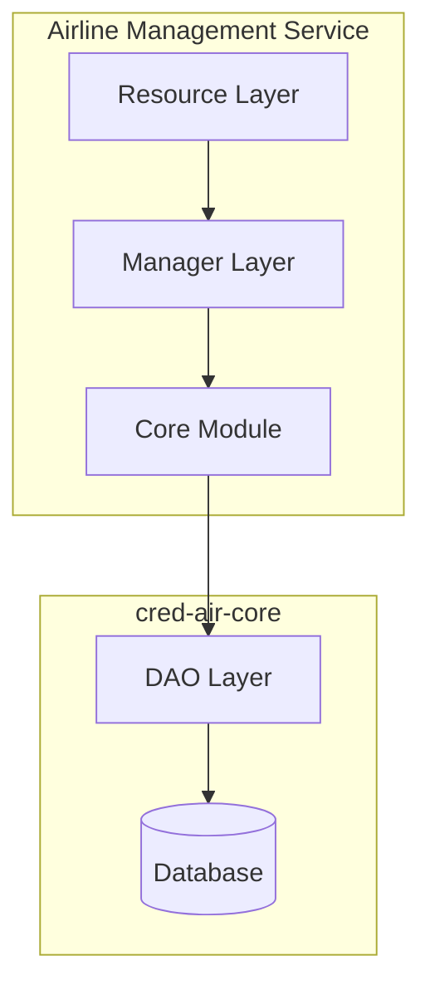

# Airline Management Service

This service is responsible for managing airline data, including onboarding new airlines and handling updates.

## Design Choices

- **Framework**: Built with [Dropwizard](https://www.dropwizard.io/), a lightweight framework for building high-performance, RESTful web services.
- **Language**: Written in [Kotlin](https://kotlinlang.org/), a modern, concise, and safe programming language.
- **Dependency Injection**: Uses [Google Guice](https://github.com/google/guice) for managing dependencies, promoting loose coupling and testability.

## Layers of Responsibility

The service follows a layered architecture to separate concerns:



-   **Resource Layer** (`com.credair.airline.resource`): This layer is responsible for handling incoming HTTP requests and exposing RESTful endpoints. It delegates the business logic to the manager layer.
-   **Manager Layer** (`com.credair.airline.manager`): This layer contains the core business logic for the service. It orchestrates calls to the `cred-air-core` module to interact with the database and other shared components.
-   **Core Module** (`cred-air-core`): This is a shared module that contains the Data Access Objects (DAOs), data models, and other shared business logic.

## Principles Followed

-   **Separation of Concerns**: Each layer has a distinct responsibility, making the codebase easier to understand, maintain, and test.
-   **Dependency Injection**: By using Guice, we avoid tight coupling between components and can easily swap out implementations.
-   **Interface-based Design**: The service relies on interfaces for its core components (e.g., DAOs), allowing for multiple implementations and easier testing.

## API Endpoints

### Airline Management
- `GET /airlines` - Retrieve all airlines (with optional ?active=true/false filter)
- `GET /airlines/{id}` - Get airline by ID
- `GET /airlines/code/{code}` - Get airline by code
- `GET /airlines/country/{country}` - Get airlines by country
- `POST /airlines` - Create a new airline
- `PUT /airlines/{id}` - Update airline information
- `PUT /airlines/{id}/activate` - Activate an airline
- `PUT /airlines/{id}/deactivate` - Deactivate an airline
- `DELETE /airlines/{id}` - Delete an airline

### Flight Update Webhooks
- `POST /webhooks/flight` - Handle flight update webhooks from airlines

## Configuration

The service uses `server-config.yml` for configuration:

```yaml
server:
  applicationConnectors:
    - type: http
      port: 8083
  adminConnectors:
    - type: http
      port: 8084

database:
  driverClass: org.postgresql.Driver
  url: jdbc:postgresql://localhost:5432/credair
  user: ${DB_USER:-credair}
  password: ${DB_PASSWORD:-password}
```

## Dependencies

- **cred-air-core**: Shared business logic and data access
- **Dropwizard**: Web framework
- **Kotlin**: Programming language
- **Google Guice**: Dependency injection
- **PostgreSQL**: Database

## Running the Service

### From Project Root
```bash
mvn -pl airline-mgt-service clean install exec:java -Dexec.args="server airline-mgt-service/src/main/resources/server-config.yml"
```

### From Service Directory
```bash
cd airline-mgt-service
mvn clean install exec:java -Dexec.args="server src/main/resources/server-config.yml"
```


## Testing

Run unit tests:
```bash
mvn test
```

Run integration tests:
```bash
mvn verify
```

## Key Components

### AirlineResource
- Full CRUD operations for airline management
- Filtering by active status, country, and airline code
- Comprehensive error handling with proper HTTP status codes
- Input validation and response formatting

### WebhookResource
- Processes flight update webhooks from airline partners
- Updates flight information via FlightUpdateManager
- Validates required fields (flight ID)
- Structured logging for webhook processing

### AirlineModule (Guice Configuration)
- Configures dependency injection
- Binds interfaces to implementations
- Manages service lifecycle

## Integration Points

### With Cred-Air Core
- Uses `AirlineManager` for business logic
- Leverages `AirlineDao` for data persistence
- Utilizes shared models and utilities

### With External Airlines
- Receives webhook notifications
- Processes real-time updates
- Handles airline-specific data formats

## Security Considerations

- Webhook signature verification
- Input validation and sanitization
- Secure database connection handling
- Environment-based configuration for secrets

## Monitoring and Logging

- Health check endpoint at `/health`
- Structured logging throughout the service
- Request/response logging for debugging
- Performance metrics collection

## Future Enhancements

- Rate limiting for API endpoints
- Caching for frequently accessed airline data
- Advanced webhook retry mechanisms
- Comprehensive API documentation with OpenAPI/Swagger