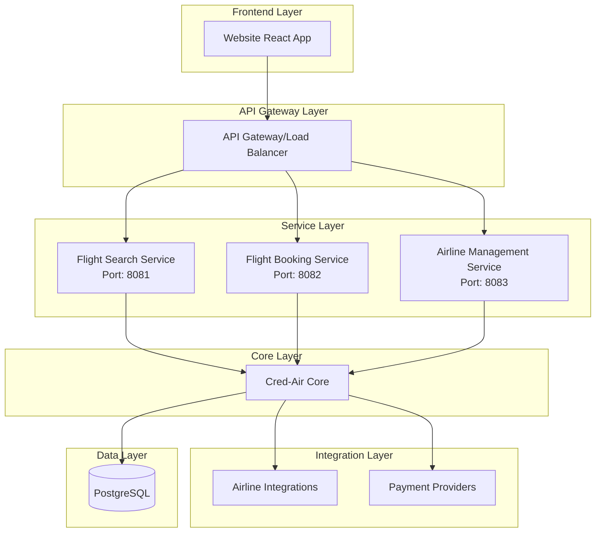
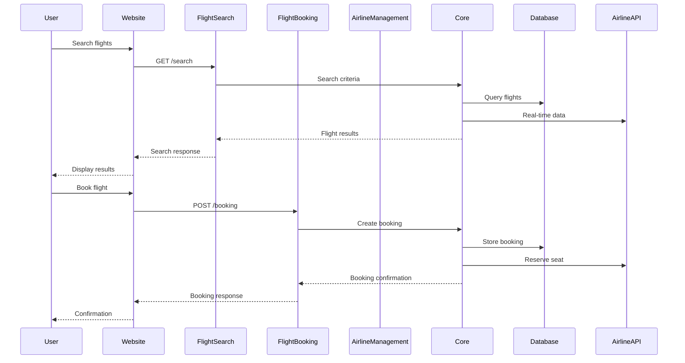

# Cred-Air System Architecture

## Overview

Cred-Air is a microservices-based airline aggregation system built with Kotlin and Dropwizard, following a clean architecture pattern with clear separation of concerns.

## Architecture Principles

- **Microservices Architecture**: Independent, loosely coupled services
- **Domain-Driven Design**: Each service owns its domain logic
- **Interface Segregation**: Extensive use of interfaces for plug-and-play architecture
- **Event-Driven Communication**: Services communicate through events where appropriate
- **Database Per Service**: Each service manages its own data

## System Components

### Frontend Layer
- **Website** (React/TypeScript): User-facing web application

### Service Layer
- **Flight Search Service**: Handles flight search and filtering
- **Flight Booking Service**: Manages booking lifecycle and payments
- **Airline Management Service**: Manages airline data and webhooks

### Core Layer
- **Cred-Air Core**: Shared business logic, data models, and utilities

### Data Layer
- **PostgreSQL**: Primary database for all services

## Detailed Architecture

### Service Communication



### Data Flow Architecture



## Module Architecture

### Cred-Air Core

Central module containing shared components:

```
cred-air-core/
├── dao/              # Data Access Objects
├── model/            # Domain models
├── manager/          # Business logic managers
├── integration/      # External service integrations
├── payment/          # Payment processing
├── events/           # Event handling
├── util/             # Utility classes
└── services/         # Core services
```

**Key Components:**
- **DAOs**: Database abstraction layer with interface-based design
- **Managers**: Business logic coordinators
- **Integration Layer**: Airline-specific reservation services
- **Payment System**: Pluggable payment providers (Stripe, etc.)
- **Event System**: Flight change detection and notification

### Flight Search Service

Handles flight search operations:

```
flight-search-service/
├── resource/         # REST endpoints
├── managers/         # Search business logic
├── models/           # Request/response models
└── utils/            # Validation utilities
```

**Key Features:**
- Real-time flight search
- Advanced filtering and sorting
- Route validation
- Caching for performance

### Flight Booking Service

Manages the booking lifecycle:

```
flight-booking-service/
├── resource/         # Booking endpoints
├── manager/          # Booking business logic
└── config/           # Service configuration
```

**Key Features:**
- Booking creation and management
- Payment processing integration
- Booking status tracking
- Webhook handling for external updates

### Airline Management Service

Handles airline data and integration:

```
airline-mgt-service/
├── resource/         # Airline management endpoints
├── manager/          # Airline business logic
└── config/           # Service configuration
```

**Key Features:**
- Airline onboarding
- Webhook management
- Airline data synchronization
- Integration status monitoring

## Design Patterns

### Repository Pattern
- Abstracts data access through interfaces
- Enables easy testing and database switching

### Manager Pattern
- Encapsulates business logic
- Coordinates between DAOs and external services

### Provider Pattern
- Plugin architecture for payments and integrations
- Easy addition of new providers

### Event-Driven Pattern
- Asynchronous event processing
- Decoupled communication between components

## Data Architecture

### Database Design
- **Normalized relational design** for consistency
- **Materialized views** for performance optimization
- **Migration scripts** for schema evolution

### Key Entities
- **Airlines**: Airline information and configuration
- **Flights**: Flight schedules and availability
- **Bookings**: Customer reservations and status
- **Passengers**: Passenger information
- **Payments**: Transaction records

## Integration Architecture

### Airline Integrations
- **Provider-specific adapters** for each airline
- **Common interface** for all airline operations
- **Fallback mechanisms** for service failures

### Payment Integrations
- **Stripe integration** for payment processing
- **Pluggable architecture** for additional providers
- **Secure handling** of payment credentials

## Security Architecture

- **Environment-based configuration** for secrets
- **Interface-based access control**
- **Secure communication** between services
- **Payment security** compliance

## Deployment Architecture

### Service Deployment
- Each service runs independently
- Configurable ports and environments
- Health check endpoints for monitoring

### Database Deployment
- Shared PostgreSQL instance
- Service-specific schemas
- Migration management per service

## Scalability Considerations

- **Horizontal scaling** of individual services
- **Database connection pooling**
- **Caching strategies** for frequently accessed data
- **Load balancing** across service instances

## Monitoring and Observability

- **Health check endpoints** for all services
- **Structured logging** throughout the system
- **Metrics collection** for performance monitoring
- **Error tracking** and alerting