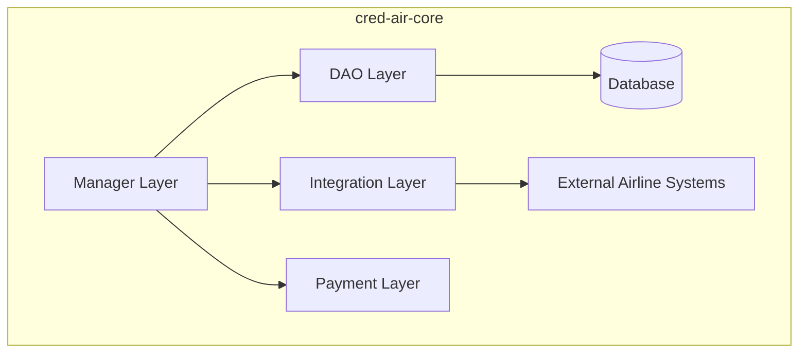

# Cred-Air Core

This module is the core of the Cred-Air system, containing shared business logic, data models, and infrastructure components.

## Design Choices

- **Language**: Written in [Kotlin](https://kotlinlang.org/), a modern, concise, and safe programming language.
- **Database Access**: Uses [JDBI](https://jdbi.org/) for database access, providing a more fluent and convenient API than raw JDBC.
- **Dependency Injection**: Uses [Google Guice](https://github.com/google/guice) for managing dependencies, promoting loose coupling and testability.

## Layers of Responsibility

The module is organized into the following layers, promoting a clear separation of concerns:

-   **Manager Layer** (`com.credair.core.manager`): This layer contains the core business logic that is shared across multiple services. For example, the `AirlineManager` handles the business logic for creating, updating, and retrieving airline data.
-   **DAO Layer** (`com.credair.core.dao`): This layer is responsible for all database interactions. It uses JDBI to execute SQL queries and map the results to Kotlin data classes.
-   **Integration Layer** (`com.credair.core.integration`): This layer defines the contracts for communicating with external systems. The `AirlineReservationService` interface, for example, specifies how to interact with an airline's external reservation system to perform actions like reserving seats or confirming bookings.
-   **Payment Layer** (`com.credair.core.payment`): This layer provides an abstraction for payment processing, with a `StripePaymentManager` as the default implementation.
-   **Model Layer** (`com.credair.core.model`): This layer contains the data models (e.g., `Airline`, `Booking`, `Flight`) that are used throughout the application.

## Principles Followed

-   **Don't Repeat Yourself (DRY)**: By centralizing shared code in this module, we avoid duplication and ensure consistency across the services.
-   **Separation of Concerns**: Each layer has a distinct responsibility, making the codebase easier to understand, maintain, and test.
-   **Interface-based Design**: The module relies heavily on interfaces for its core components (e.g., DAOs, `AirlineReservationService`, `PaymentProvider`), allowing for multiple implementations and easier testing.