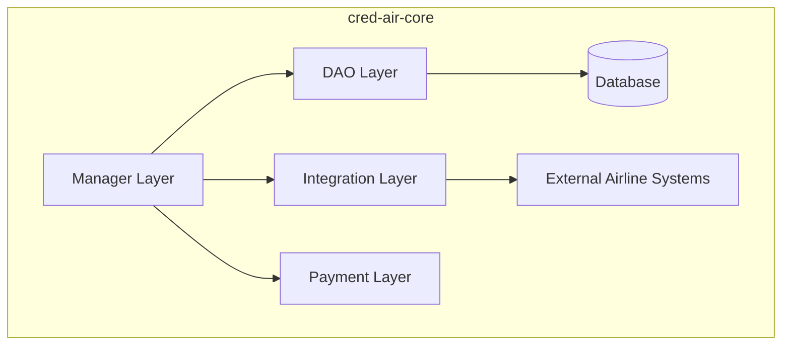
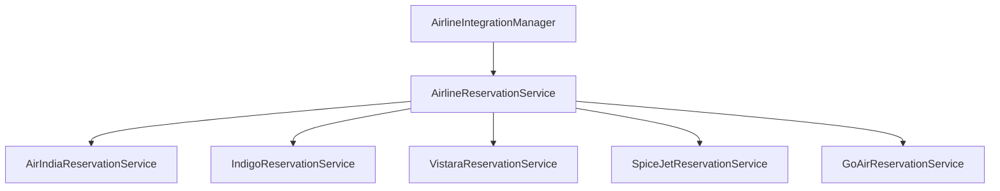

# Cred-Air Core

This module is the core of the Cred-Air system, containing shared business logic, data models, and infrastructure components.

## Design Choices

- **Language**: Written in [Kotlin](https://kotlinlang.org/), a modern, concise, and safe programming language.
- **Database Access**: Uses [JDBI](https://jdbi.org/) for database access, providing a more fluent and convenient API than raw JDBC.
- **Dependency Injection**: Uses [Google Guice](https://github.com/google/guice) for managing dependencies, promoting loose coupling and testability.

## Layers of Responsibility

The module is organized into the following layers, promoting a clear separation of concerns:



-   **Manager Layer** (`com.credair.core.manager`): This layer contains the core business logic that is shared across multiple services. For example, the `AirlineManager` handles the business logic for creating, updating, and retrieving airline data.
-   **DAO Layer** (`com.credair.core.dao`): This layer is responsible for all database interactions. It uses JDBI to execute SQL queries and map the results to Kotlin data classes.
-   **Integration Layer** (`com.credair.core.integration`): This layer defines the contracts for communicating with external systems. The `AirlineReservationService` interface, for example, specifies how to interact with an airline's external reservation system to perform actions like reserving seats or confirming bookings.
-   **Payment Layer** (`com.credair.core.payment`): This layer provides an abstraction for payment processing, with a `StripePaymentManager` as the default implementation.
-   **Model Layer** (`com.credair.core.model`): This layer contains the data models (e.g., `Airline`, `Booking`, `Flight`) that are used throughout the application.

## Principles Followed

-   **Don't Repeat Yourself (DRY)**: By centralizing shared code in this module, we avoid duplication and ensure consistency across the services.
-   **Separation of Concerns**: Each layer has a distinct responsibility, making the codebase easier to understand, maintain, and test.
-   **Interface-based Design**: The module relies heavily on interfaces for its core components (e.g., DAOs, `AirlineReservationService`, `PaymentProvider`), allowing for multiple implementations and easier testing.

## Module Structure

```
cred-air-core/
├── src/main/kotlin/com/credair/
│   ├── common/                  # Common utilities and base classes
│   │   ├── dao/                 # Base DAO implementations
│   │   └── model/               # Common data models
│   └── core/
│       ├── config/              # Configuration and dependency injection
│       ├── dao/                 # Data Access Objects
│       │   └── interfaces/      # DAO interface definitions
│       ├── events/              # Event handling and publishing
│       ├── integration/         # External system integrations
│       │   └── airline/         # Airline-specific integrations
│       │       └── providers/   # Individual airline providers
│       ├── manager/             # Business logic managers
│       ├── model/               # Core data models
│       ├── payment/             # Payment processing
│       ├── repository/          # Repository pattern implementations
│       ├── services/            # Core services
│       └── util/                # Utility classes and helpers
└── src/main/resources/
    └── db/migration/            # Database migration scripts
```

## Core Components

### Data Access Layer (DAO)

**Interface-based Design**: All DAOs implement interfaces for maximum flexibility:

- `AirlineDao` - Airline data operations
- `FlightDao` - Flight data management
- `BookingDao` - Booking operations
- `FlightPassengerDao` - Passenger information
- `FlightBookingDao` - Flight-booking relationships
- `FlightsMaterializedViewDao` - Optimized flight queries

**Key Features**:
- JDBI-based implementation for type safety
- Transaction management
- Connection pooling
- Result set mapping to Kotlin data classes

### Business Logic Layer (Managers)

**Core Managers**:
- `AirlineManager` - Airline business operations
- `BookingManager` - Booking lifecycle management
- `FlightUpdateManager` - Flight data synchronization

**Responsibilities**:
- Coordinate between DAOs and external services
- Implement business rules and validation
- Handle complex multi-step operations
- Manage transactions across multiple data sources

### Integration Layer

**Airline Integration System**:


**Features**:
- Plugin architecture for adding new airlines
- Common interface for all airline operations
- Provider-specific implementation details
- Fallback and error handling mechanisms

### Payment Processing

**Payment Providers**:
- `StripePaymentManager` - Stripe integration
- `PaymentProvider` interface for additional providers

**Capabilities**:
- Payment intent creation
- Payment confirmation handling
- Webhook processing
- Refund management
- Multi-currency support (planned)

### Event System

**Event Management**:
- `FlightChangeEvents` - Flight status change events
- `FlightEventPublisher` - Event publishing mechanism

**Use Cases**:
- Real-time flight updates
- Booking status notifications
- Price change alerts
- Schedule modification handling

## Data Models

### Core Entities

**Airline Model**:
```kotlin
data class Airline(
    val id: Long,
    val name: String,
    val code: String,
    val country: String,
    val active: Boolean
)
```

**Flight Model**:
```kotlin
data class Flight(
    val id: Long,
    val flightNumber: String,
    val airlineId: Long,
    val origin: String,
    val destination: String,
    val departureTime: LocalDateTime,
    val arrivalTime: LocalDateTime,
    val price: BigDecimal,
    val availableSeats: Int
)
```

**Booking Model**:
```kotlin
data class Booking(
    val id: Long,
    val flightId: Long,
    val passengerName: String,
    val passengerEmail: String,
    val status: BookingStatus,
    val paymentStatus: PaymentStatus,
    val totalAmount: BigDecimal,
    val createdAt: LocalDateTime
)
```

### Enums and Status Types

- `BookingStatus`: PENDING, CONFIRMED, CANCELLED, FAILED, EXPIRED
- `PaymentStatus`: PENDING, COMPLETED, FAILED, REFUNDED

## Configuration Management

### Dependency Injection (Guice)

**CredAirCoreModule**:
- Binds DAO interfaces to implementations
- Configures database connections
- Sets up payment providers
- Manages service lifecycles

**SecretsManager**:
- Environment-based configuration
- Secure handling of API keys and secrets
- Configuration validation and defaults

## Utility Components

### ID Generation
- `SnowflakeIdGenerator` - Distributed unique ID generation
- Thread-safe and collision-resistant
- Timestamp-based ordering

### Change Detection
- `FlightChangeDetector` - Identifies flight data changes
- Diff-based comparison
- Event triggering for significant changes

### Database Utilities
- Connection management interfaces
- Transaction handling utilities
- Result set mapping helpers

## Testing Strategy

### Unit Testing
- Manager layer testing with mocked dependencies
- DAO testing with in-memory databases
- Utility class testing with comprehensive scenarios

### Integration Testing
- Database integration tests
- Payment provider integration tests
- Airline integration tests

### Test Utilities
- Test data builders
- Mock service implementations
- Database setup and teardown helpers

## Database Design

### Migration Management
- SQL-based migration scripts in `src/main/resources/db/migration/`
- Version-controlled schema changes
- Rollback capability for schema updates

### Key Tables
- `airlines` - Airline master data
- `flights` - Flight schedules and pricing
- `bookings` - Customer booking records
- `passengers` - Passenger information
- `flight_bookings` - Flight-booking relationships

### Materialized Views
- `unified_flight_journeys_view` - Optimized flight search data
- Automated refresh strategies
- Performance monitoring and optimization

## Performance Optimizations

### Database Performance
- Strategic indexing on search columns
- Connection pooling with HikariCP
- Query optimization and execution plans
- Materialized views for complex queries

### Caching Strategy
- In-memory caching for frequently accessed data
- Cache invalidation on data updates

### Async Processing
- Event-driven architecture for non-blocking operations
- Background job processing for heavy operations
- Queue management for reliable processing

## Security Features

### Data Protection
- Input validation and sanitization
- SQL injection prevention through parameterized queries
- Sensitive data encryption at rest

### API Security
- Secure handling of payment provider credentials
- Environment-based secret management
- Audit logging for sensitive operations

## Future Enhancements

### Planned Features
- GraphQL API support
- Advanced caching strategies
- Event sourcing implementation
- Microservice communication patterns
- Advanced monitoring and observability

### Scalability Improvements
- Database sharding strategies
- Read replica support
- Horizontal scaling patterns
- Performance monitoring and alerting