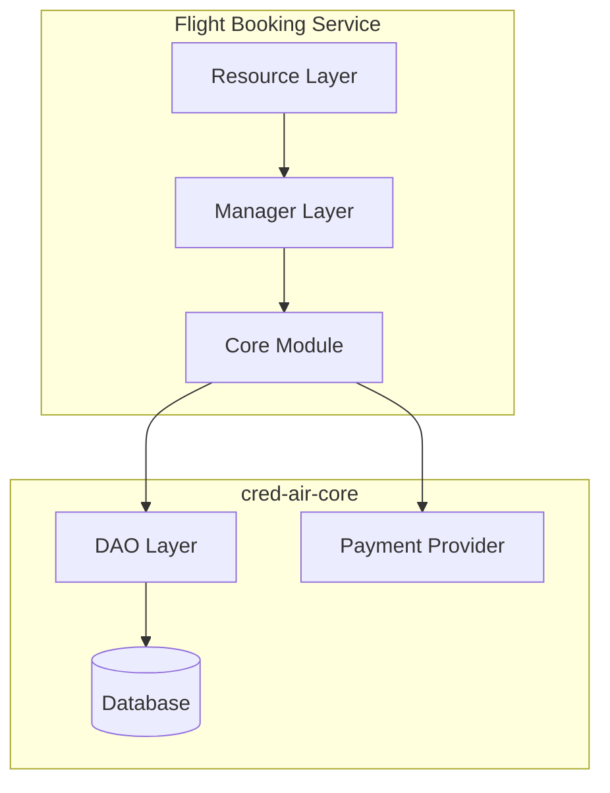
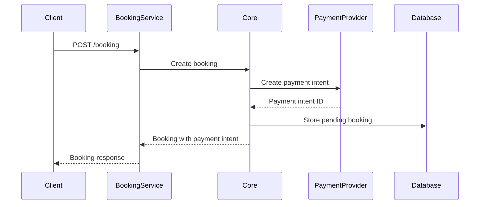
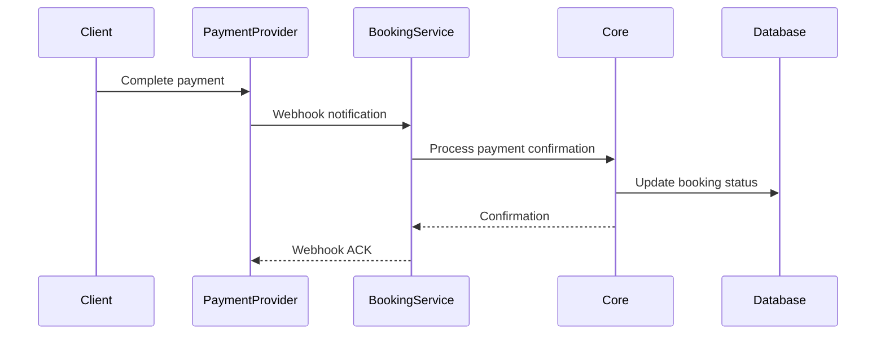

# Flight Booking Service

This service is responsible for handling the flight booking process.

## Design Choices

- **Framework**: Built with [Dropwizard](https://www.dropwizard.io/), a lightweight framework for building high-performance, RESTful web services.
- **Language**: Written in [Kotlin](https://kotlinlang.org/), a modern, concise, and safe programming language.
- **Dependency Injection**: Uses [Google Guice](https://github.com/google/guice) for managing dependencies, promoting loose coupling and testability.

## Layers of Responsibility

The service follows a layered architecture to separate concerns:



-   **Resource Layer** (`com.credair.booking.resource`): This layer is responsible for handling incoming HTTP requests and exposing RESTful endpoints for booking flights. It delegates the business logic to the manager layer.
-   **Manager Layer** (`com.credair.booking.manager`): This layer contains the core business logic for the booking process. It orchestrates calls to the `cred-air-core` module to create bookings, process payments, and update booking statuses.
-   **Core Module** (`cred-air-core`): This is a shared module that contains the Data Access Objects (DAOs), data models, payment provider integrations, and other shared business logic.

## Principles Followed

-   **Separation of Concerns**: Each layer has a distinct responsibility, making the codebase easier to understand, maintain, and test.
-   **Dependency Injection**: By using Guice, we avoid tight coupling between components and can easily swap out implementations.
-   **Interface-based Design**: The service relies on interfaces for its core components (e.g., DAOs, PaymentProvider), allowing for multiple implementations and easier testing.
-   **Transactional Integrity**: The booking process is designed to be transactional, ensuring that a booking is only created if the payment is successful.

## API Endpoints

### Booking Management
- `POST /bookings` - Create new flight bookings from frontend payload
  - Request Body: BookingRequestPayload with flight and passenger details
  - Response: Created bookings with soft reservation status
  - Uses async processing for better performance

- `GET /bookings/{bookingId}/confirmation` - Get booking confirmation details
  - Path Parameter: `bookingId` - Booking ID
  - Response: Complete booking confirmation information
  - Uses async processing

### Stripe Webhook Handling
- `POST /webhooks/stripe` - Handle Stripe payment webhooks
  - Headers: `Stripe-Signature` for webhook verification
  - Request Body: Stripe webhook payload
  - Supported Events:
    - `payment_intent.succeeded` - Confirms booking from soft reservation
    - `payment_intent.payment_failed` - Cancels failed bookings
    - `payment_intent.canceled` - Cancels cancelled payments
  - Automatic booking status updates based on payment events

## Configuration

The service uses `server-config.yml` for configuration:

```yaml
server:
  applicationConnectors:
    - type: http
      port: 8082
  adminConnectors:
    - type: http
      port: 8083

database:
  driverClass: org.postgresql.Driver
  url: jdbc:postgresql://localhost:5432/credair
  user: ${DB_USER:-credair}
  password: ${DB_PASSWORD:-password}

# Stripe configuration is handled via environment variables:
# STRIPE_API_KEY - for payment processing
# STRIPE_WEBHOOK_SECRET - for webhook verification
```

## Dependencies

- **cred-air-core**: Shared business logic and data access
- **Dropwizard**: Web framework
- **Kotlin**: Programming language
- **Google Guice**: Dependency injection
- **PostgreSQL**: Database
- **Stripe**: Payment processing

## Running the Service

### From Project Root
```bash
mvn -pl flight-booking-service clean install exec:java -Dexec.args="server flight-booking-service/src/main/resources/server-config.yml"
```

### From Service Directory
```bash
cd flight-booking-service
mvn clean install exec:java -Dexec.args="server src/main/resources/server-config.yml"
```


## Testing

Run unit tests:
```bash
mvn test
```

Run integration tests:
```bash
mvn verify
```

## Key Components

### BookingResource
- Async processing for booking creation and retrieval
- Integration with BookingManager for business logic
- Comprehensive error handling for different scenarios
- Support for BookingRequestPayload structure

### WebhookResource
- Stripe webhook signature verification using environment variables
- Event-based processing for different payment states
- Automatic booking confirmation/cancellation based on payment status
- Metadata-based booking ID extraction from payment intents
- Comprehensive logging for webhook processing

### BookingModule (Guice Configuration)
- Configures dependency injection
- Binds payment providers
- Manages service lifecycle

## Booking Process Flow

### 1. Booking Creation


### 2. Payment Processing


## Booking States

- **SOFT_RESERVED**: Initial booking created, seats temporarily held
- **CONFIRMED**: Payment successful, booking confirmed
- **CANCELLED**: Booking cancelled due to payment failure or user action
- **FAILED**: Booking creation or processing failed

## Integration Points

### With Cred-Air Core
- Uses `BookingManager` for business logic
- Leverages `BookingDao` for data persistence
- Utilizes `PaymentProvider` for payment processing

### With Flight Search Service
- Validates flight availability
- Retrieves current flight pricing
- Checks seat availability

### With Airline Management Service
- Communicates booking confirmations
- Handles airline-specific requirements
- Processes booking modifications

### With External Payment Providers
- Stripe integration for payment processing
- Webhook handling for payment events
- Secure payment data management

## Security Considerations

### Payment Security
- PCI DSS compliance considerations
- Secure API key management
- Webhook signature verification
- Sensitive data encryption

### Data Protection
- Personal information encryption
- Secure database connections
- Input validation and sanitization
- Rate limiting and DDoS protection

## Error Handling

### Payment Failures
- Graceful handling of payment errors
- Automatic retry mechanisms
- User-friendly error messages
- Detailed logging for debugging

### Booking Conflicts
- Seat availability validation
- Price change handling
- Timeout management
- Concurrent booking resolution

## Monitoring and Logging

### Metrics
- Booking success/failure rates
- Payment processing times
- Average booking value
- Customer conversion rates

### Logging
- Structured logging for all operations
- Audit trail for booking changes
- Payment transaction logging
- Error tracking and alerting

## Future Enhancements

- Multi-currency support
- Dynamic pricing integration
- Loyalty program integration
- Advanced fraud detection
- Real-time inventory management
- Automated refund processing
- Split payment handling
- Group booking capabilities