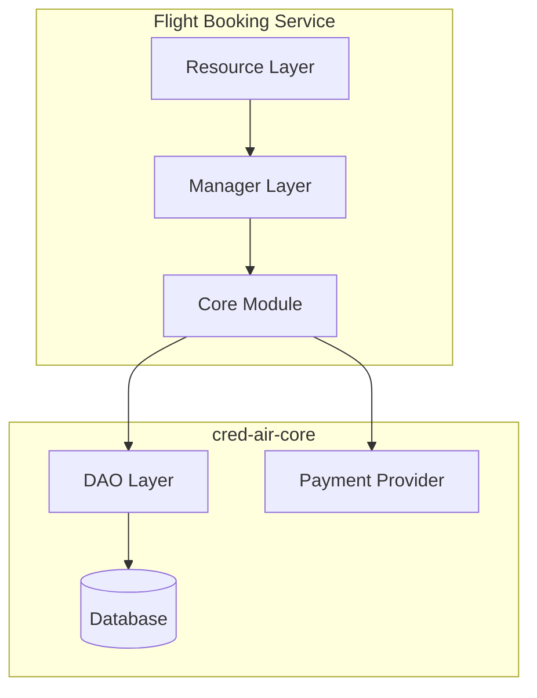

# Flight Booking Service

This service is responsible for handling the flight booking process.

## Design Choices

- **Framework**: Built with [Dropwizard](https://www.dropwizard.io/), a lightweight framework for building high-performance, RESTful web services.
- **Language**: Written in [Kotlin](https://kotlinlang.org/), a modern, concise, and safe programming language.
- **Dependency Injection**: Uses [Google Guice](https://github.com/google/guice) for managing dependencies, promoting loose coupling and testability.

## Layers of Responsibility

The service follows a layered architecture to separate concerns:

-   **Resource Layer** (`com.credair.booking.resource`): This layer is responsible for handling incoming HTTP requests and exposing RESTful endpoints for booking flights. It delegates the business logic to the manager layer.
-   **Manager Layer** (`com.credair.booking.manager`): This layer contains the core business logic for the booking process. It orchestrates calls to the `cred-air-core` module to create bookings, process payments, and update booking statuses.
-   **Core Module** (`cred-air-core`): This is a shared module that contains the Data Access Objects (DAOs), data models, payment provider integrations, and other shared business logic.

## Principles Followed

-   **Separation of Concerns**: Each layer has a distinct responsibility, making the codebase easier to understand, maintain, and test.
-   **Dependency Injection**: By using Guice, we avoid tight coupling between components and can easily swap out implementations.
-   **Interface-based Design**: The service relies on interfaces for its core components (e.g., DAOs, PaymentProvider), allowing for multiple implementations and easier testing.
-   **Transactional Integrity**: The booking process is designed to be transactional, ensuring that a booking is only created if the payment is successful.