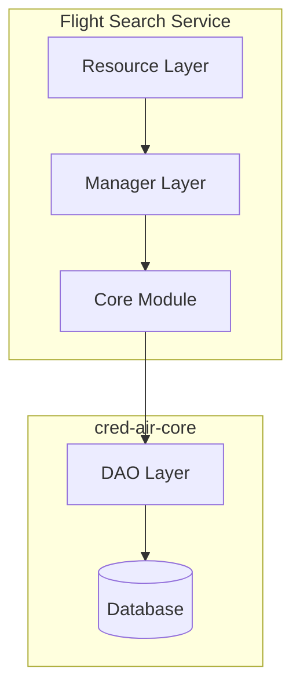

# Flight Search Service

This service is responsible for providing flight search functionality to users.

## Design Choices

- **Framework**: Built with [Dropwizard](https://www.dropwizard.io/), a lightweight framework for building high-performance, RESTful web services.
- **Language**: Written in [Kotlin](https://kotlinlang.org/), a modern, concise, and safe programming language.
- **Dependency Injection**: Uses [Google Guice](https://github.com/google/guice) for managing dependencies, promoting loose coupling and testability.

## Layers of Responsibility

The service follows a layered architecture to separate concerns:



-   **Resource Layer** (`com.credair.flight.search.resource`): This layer is responsible for handling incoming HTTP requests and exposing RESTful endpoints for flight searches. It delegates the business logic to the manager layer.
-   **Manager Layer** (`com.credair.flight.search.managers`): This layer contains the core business logic for searching flights. It orchestrates calls to the `cred-air-core` module to query the database and aggregate results.
-   **Core Module** (`cred-air-core`): This is a shared module that contains the Data Access Objects (DAOs), data models, and other shared business logic.

## Principles Followed

-   **Separation of Concerns**: Each layer has a distinct responsibility, making the codebase easier to understand, maintain, and test.
-   **Dependency Injection**: By using Guice, we avoid tight coupling between components and can easily swap out implementations.
-   **Interface-based Design**: The service relies on interfaces for its core components (e.g., DAOs), allowing for multiple implementations and easier testing.
-   **Materialized Views**: The service utilizes a materialized view (`flights_materialized_view`) to optimize search performance by pre-aggregating flight data.

## API Endpoints

### Flight Search
- `GET /search/flights` - Search for flights based on criteria
  - Query Parameters:
    - `from` - Source airport code (required)
    - `to` - Destination airport code (required)
    - `date` - Departure date in ISO format (optional)
    - `minSeats` - Minimum number of seats required (optional, default: 1)
    - `sortBy` - Sort criteria (DURATION, PRICE, DEPARTURE_TIME)
    - `sortOrder` - Sort order (ASC, DESC)
    - `page` - Page number for pagination (optional, default: 0)
    - `pageSize` - Number of results per page (optional, default: 10)

### Flight Details
- `POST /search/getDetails` - Get detailed flight journey information
  - Request Body: List of flight IDs
  - Response: Complete flight journey details

## Configuration

The service uses `server-config.yml` for configuration:

```yaml
server:
  applicationConnectors:
    - type: http
      port: 8081
  adminConnectors:
    - type: http
      port: 8082

database:
  driverClass: org.postgresql.Driver
  url: jdbc:postgresql://localhost:5432/credair
  user: ${DB_USER:-credair}
  password: ${DB_PASSWORD:-password}

# Flight search specific configuration would go here
```

## Dependencies

- **cred-air-core**: Shared business logic and data access
- **Dropwizard**: Web framework
- **Kotlin**: Programming language
- **Google Guice**: Dependency injection
- **PostgreSQL**: Database

## Running the Service

### From Project Root
```bash
mvn -pl flight-search-service clean install exec:java -Dexec.args="server flight-search-service/src/main/resources/server-config.yml"
```

### From Service Directory
```bash
cd flight-search-service
mvn clean install exec:java -Dexec.args="server src/main/resources/server-config.yml"
```


## Testing

Run unit tests:
```bash
mvn test
```

Run integration tests:
```bash
mvn verify
```

## Key Components

### FlightSearchResource
- Handles flight search requests with comprehensive parameter validation
- Pagination support for large result sets
- Date parsing with ISO format support
- Detailed flight journey retrieval
- Comprehensive error handling with proper HTTP status codes

### FlightSearchManager
- Core search business logic implementation
- Integration with materialized views for performance
- Sorting and pagination functionality
- Flight journey aggregation

### SearchCriteria Model
- Encapsulates search parameters (source, destination, date, seats)
- Used for structured query building

### SortCriteria Model
- Defines sorting options (DURATION, PRICE, DEPARTURE_TIME)
- Support for ascending and descending order

## Search Features

### Basic Search
- Origin and destination airports
- Departure date selection
- Passenger count specification
- Travel class preferences

### Advanced Filtering
- Price range filtering
- Duration constraints
- Airline preferences
- Time of day preferences

### Sorting Options
- By price (ascending/descending)
- By duration (shortest first)
- By departure time
- By arrival time
- By airline rating

### Performance Optimizations
- Materialized view for fast queries
- Connection pooling for database access
- Result caching for repeated searches
- Pagination for large result sets

## Integration Points

### With Cred-Air Core
- Uses `FlightDao` for flight data access
- Leverages `FlightsMaterializedViewDao` for optimized queries
- Utilizes shared flight models and utilities

### With Flight Booking Service
- Provides flight IDs for booking references
- Shares flight availability information
- Coordinates real-time price updates

### With External Data Sources
- Real-time flight status updates
- Dynamic pricing information
- Seat availability synchronization

## Performance Considerations

### Database Optimization
- Materialized views for complex queries
- Proper indexing on search columns
- Query optimization and execution plans

### Caching Strategy
- In-memory caching for frequent searches
- Cache invalidation on data updates

### Response Optimization
- Pagination for large result sets
- Lazy loading of detailed flight information
- Compression for response payloads

## Error Handling

- Comprehensive input validation
- Graceful handling of external service failures
- User-friendly error messages
- Proper HTTP status codes

## Monitoring and Logging

- Request/response logging
- Search performance metrics
- Cache hit/miss ratios
- Database query performance tracking

## Future Enhancements

- Advanced search algorithms
- Machine learning for search result ranking
- Personalized search recommendations
- Multi-currency support
- Advanced fare prediction algorithms